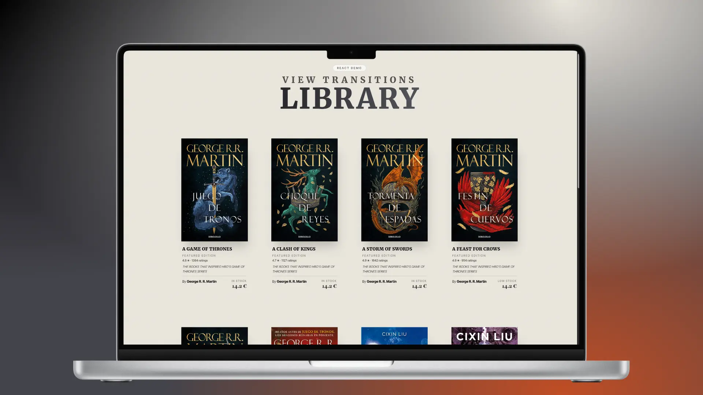
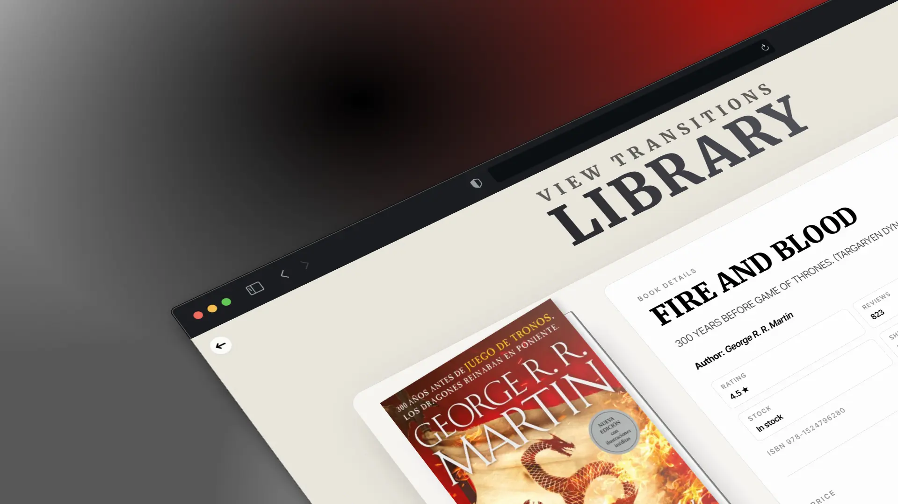

# Bookshop View Transitions (Vite + React)


## 🌍 Quick Navigation

- [🇪🇸 Español](#-español)
- [🇬🇧 English](#-english)

---

## 🇪🇸 Español

### 📚 Descripción
Demo de una tienda de libros con navegación entre páginas usando **View Transitions**, construida con **Vite + React**.



### ✨ Características
- Transiciones suaves entre Home y detalle de libro.
- Responsive para móvil, tablet, desktop y pantallas grandes.
- UI editorial con datos mock de tienda (rating, stock, formato, envío, ISBN, páginas).
- Enfoque visual en cards y detalle de producto.

### 🧰 Tecnologías
- React 18
- Vite
- React Router DOM
- Tailwind CSS
- API de View Transitions del navegador

### 🚀 Ejecución local
```bash
npm install
npm run dev
```

### 🧪 Scripts
```bash
npm run dev
npm run build
npm run preview
npm run lint
```

### 🤝 Contribuciones
¿Quieres mejorar animaciones, UI o accesibilidad?

- Haz fork del repo.
- Crea una rama con tu mejora.
- Abre una PR con contexto y capturas.

Las PRs son bienvenidas y se revisan con cariño.

---

## 🇬🇧 English

### 📚 Overview
A bookshop demo with page-to-page navigation powered by **View Transitions**, built with **Vite + React**.



### ✨ Features
- Smooth transitions between Home and Book Detail pages.
- Responsive layout for mobile, tablet, desktop, and large screens.
- Editorial-style UI with mocked store metadata (rating, stock, format, shipping, ISBN, pages).
- Strong visual focus on product cards and detail screens.

### 🧰 Tech Stack
- React 18
- Vite
- React Router DOM
- Tailwind CSS
- Browser View Transitions API

### 🚀 Run locally
```bash
npm install
npm run dev
```

### 🧪 Scripts
```bash
npm run dev
npm run build
npm run preview
npm run lint
```

### 🤝 Contributing
Want to improve transitions, UI, or accessibility?

- Fork the repository.
- Create a feature branch.
- Open a PR with context and screenshots.

PRs are always welcome.

---

## 🌐 Live Demo
[https://bookshop-view-transitions-vite.vercel.app/](https://bookshop-view-transitions-vite.vercel.app/)

## 📄 License
This project is licensed under the MIT License.

---

## 👨‍💻 Portfolio
Fr4n0m: [https://codebyfran.es](https://codebyfran.es)
